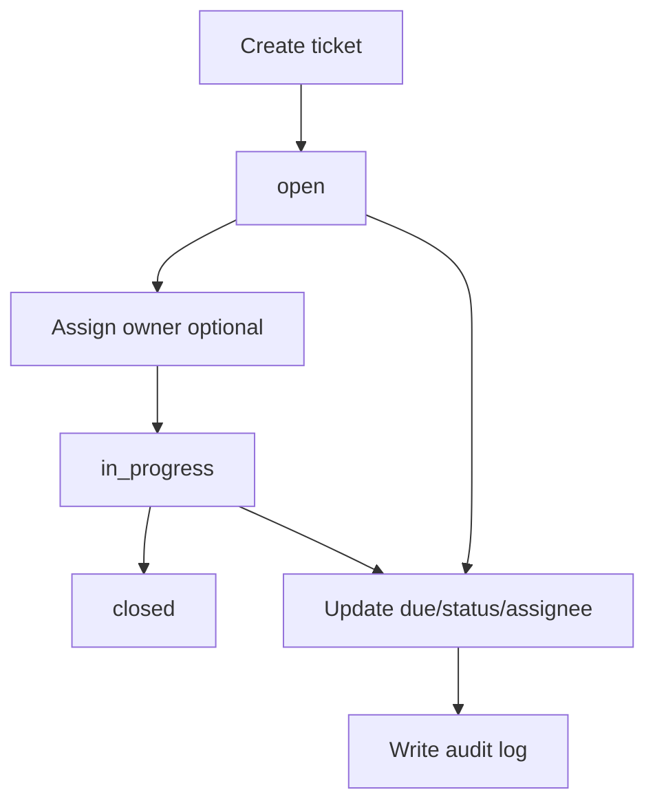
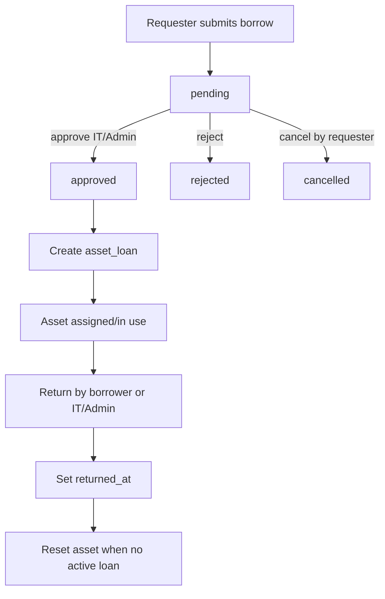
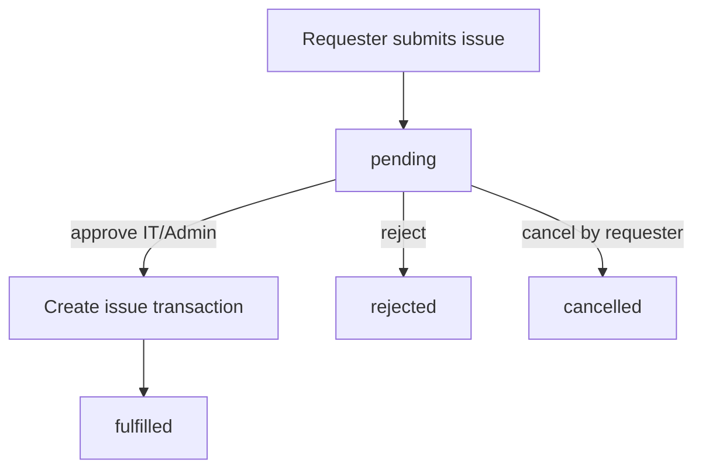
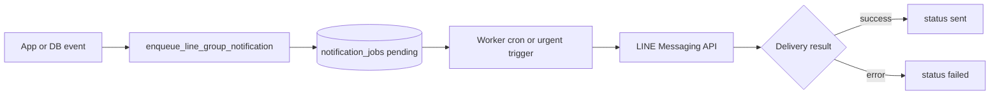
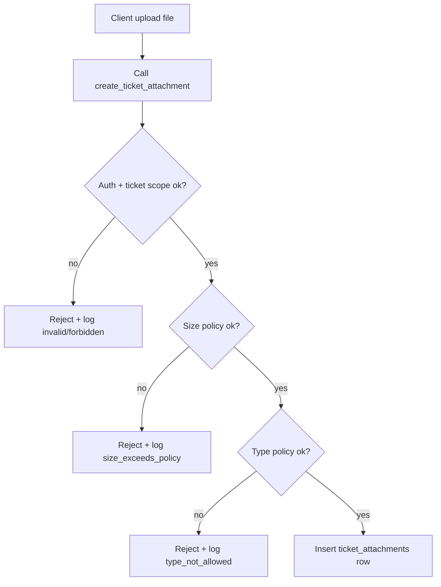
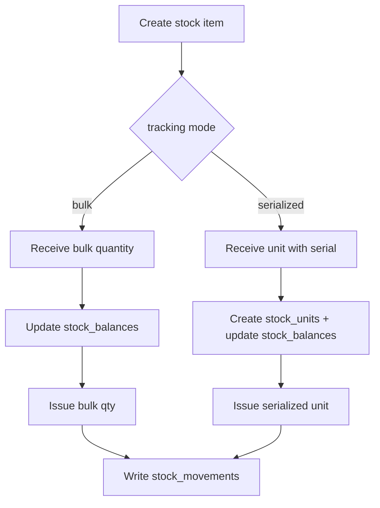

# System Workflows

This document is the operational workflow reference for the project.

## 1) Ticket Workflow

### States
- `open`
- `in_progress`
- `closed`

### Main flow
1. User creates ticket (`open`)
2. IT/Admin assigns ticket (optional)
3. Assignee starts work (`in_progress`)
4. Work completes (`closed`)

### Key rules
- Only authorized roles can update sensitive fields.
- Status/assignee/due-date changes should be logged.
- SLA due time is derived from:
  - `tickets.due_at` first
  - fallback to `add_business_hours(created_at, sla_policy.resolution_time_hours)`

### Notifications
- Trigger events should enqueue notification jobs.
- Critical/high urgency events should be eligible for fast dispatch.

---

## 2) Asset Borrow/Issue Workflow

## 2.1 Request Types
- `borrow` (temporary, must return)
- `issue` (consume/distribute)

## 2.2 Request States
- `pending`
- `approved`
- `rejected`
- `cancelled`
- `fulfilled`

## 2.3 Borrow flow
1. Requester creates `borrow` request (`pending`)
2. IT/Admin approves (`approved`)
3. System creates `asset_loans` row (active loan)
4. Borrower or IT/Admin returns asset (`returned_at` set)
5. Asset assignment/status is reset when no active loan remains

## 2.4 Issue flow
1. Requester creates `issue` request (`pending`)
2. IT/Admin approves
3. If request has stock reference (`stock_item_id`):
   - bulk: deduct quantity from stock balance and write stock movement
   - serialized: issue 1 stock unit by serial and write stock movement
4. System creates `asset_issue_transactions` row
5. Request is marked `fulfilled`

## 2.5 Rejection/cancel paths
- IT/Admin can reject only `pending` requests.
- Request owner can cancel only own `pending` requests.

## 2.6 Permissions summary
- Request creation: authenticated user (self as requester)
- Approve/reject: IT/Admin only
- Return loan: IT/Admin or the borrower
- Read visibility: requester/approver/borrower/issuer or IT/Admin (per table policy)

---

## 3) Notification Workflow (LINE Group)

### Pipeline
1. App/DB event calls enqueue function
2. Row inserted into `notification_jobs` (`pending`)
3. Worker processes queued jobs and sends LINE message
4. Job status updated (`sent`/`failed`)

### Dispatch behavior
- Scheduled worker runs periodically (cron).
- Urgent events can trigger immediate worker call.

### Required configuration
- Worker endpoint
- Worker secret
- Batch size
- LINE provider credentials (channel access token, target group id)
- App base URL for deep links in message

---

## 4) Attachment Upload Workflow

### Flow
1. Client uploads file object to storage path
2. Client calls `create_ticket_attachment(...)`
3. RPC validates:
   - user auth
   - ticket access scope
   - max size from settings
   - allowed types from settings
4. If valid: insert `ticket_attachments` metadata row
5. If invalid: reject and log `attachment.upload_rejected`

### Policy defaults
- max size from `attachment_max_size_mb`
- type from `attachment_allowed_types` (currently image-focused)

---

## 5) Stock Control Workflow (Hybrid)

### Tracking modes
- `bulk`: quantity-only stock (no serial per unit)
- `serialized`: per-unit stock with unique serial

### Core flow
1. Create stock item with tracking mode
2. Receive stock
   - bulk: increase `stock_balances.qty_on_hand`
   - serialized: create `stock_units` + increase balance
3. Issue stock
   - bulk: decrease quantity by requested amount
   - serialized: issue selected stock unit by serial
4. Manual adjustment for bulk items (increase/decrease)
5. Every movement writes to `stock_movements` ledger

---

## 6) Minimum Smoke Test Checklist

## Tickets
- Create ticket -> appears in list
- Change status (`open` -> `in_progress` -> `closed`) and confirm logs
- Dashboard metrics reflect overdue and trend changes

## Asset Requests
- Create `borrow` request with due date -> `pending`
- Approve request -> loan created
- Return loan -> loan closed and asset assignment/status updated
- Create `issue` request -> approve -> request `fulfilled`

## Notifications
- Enqueue test notification -> appears in queue
- Worker sends message to LINE group
- Deep link opens app route correctly

## Attachments
- Upload allowed image type -> success
- Upload blocked type/oversize -> rejected + log entry

---

## Stock control
- Create bulk item with opening qty -> balance is correct
- Receive bulk -> qty_on_hand increases
- Issue bulk -> qty_on_hand decreases and cannot go below available
- Create serialized item -> receive by serial -> issue one unit
- Check `stock_movements` ledger for every operation

---

## 7) Ownership Matrix (Who does what)

- **Requester/User**
  - Create ticket, create asset request, cancel own pending request, return own borrowed asset
- **IT/Admin**
  - Assign/update tickets, approve/reject asset requests, force return, manage settings, run test notifications
- **System/Worker**
  - SLA calculation, queue dispatch, notification delivery, policy enforcement in RPCs
